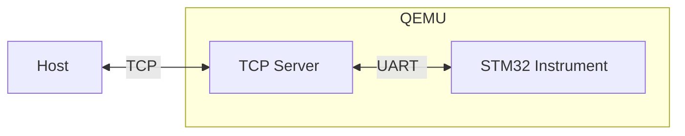

---
title:			"Against Hand-written Protocols"
series:			"Modern Embedded Development for MedTech"
description:	"Building an instrument protocol with FlatBuffers"
tags:			[
    "medtech",
    "embedded",
    "stm32",
    "flatbuffers",
    "qemu",
    "serialization"
]
publishedDate:	2025-09-10
modifiedDate:	2025-09-10
---

MedTech companies will often structure IVD (In-Vitro Diagnostic) products in two parts:

* A _host_, built on a commercial off-the-shelf (COTS) smartphone or tablet.
* An _analytical device_, which performs measurements and otherwise encapsulates as much of the highly-regulated (i.e., by the FDA or EMA) functionality as possible.

This approach lightens the validation burden on the host hardware and software, which can be classified as Class I rather than Class II or III. The cost of this architecture (which is nevertheless often worth it) is that the host and device need to communicate (Bluetooth and USB are popular choices), so you will need to design and implement a communication protocol[^1].

A large part of the first fifteen years of my career was spent implementing, designing, and extending just such a protocol across many different programming languages and codebases. If I could do it over (and if I could do it now rather than circa 2010), I would write basically none of that code myself, by hand. It was fun to write, but it was a commodity. It did not differentiate my company from its competitors and did not contribute to our competitive moat, because companies all over the world write their own custom protocols all the time. If I were doing it now, I would generate as many implementations of the protocol (e.g., C#, C, Java, etc.) as I needed using a project like [FlatBuffers](https://flatbuffers.dev/).

FlatBuffers takes a protocol specification (in the form of a FlatBuffer schema) and generates the source code required to serialize and deserialize the protocol's messages in any of a dozen or so different languages. (But not C—for that you'll need the closely-related [FlatCC](https://github.com/dvidelabs/flatcc) project.) Two alternatives to FlatBuffers are Protocol Buffers (like FlatBuffers, it was also initially developed by Google) and JSON. On a Cortex-A processor running Linux (or any more powerful system), either of these would be fine, but they're too heavy for, e.g., a Cortex-M MCU communicating over Bluetooth Low Energy (BLE). In the case of Protocol Buffers, it's the code size and memory allocations that will kill you. For JSON, the problem is sending text over the BLE link instead of binary data (a roughly 8x increase in the size of the data, or worse if you forget to strip out white space).

## FlatBuffers Schema

So let's see how to use FlatBuffers. To make this concrete, I will create a simplified protocol for a host and a hypothetical medical instrument (i.e., the _analytical device_ from above). The protocol will have just three message types:

* `Command`, which controls instrument operation with start and stop commands.
* `Configuration`, which sets instrument parameters such as the sampling rate and samples per measurement.
* `Measurement`, containing a variable-length number of samples (as specified by the configuration).

I'll go through the schema section-by-section here, but you can find the whole file in the [repo](https://github.com/Keel-Inc/FlatBuffersInstrumentProtocol/blob/main/instrument_protocol.fbs) accompanying this guide, or see the FlatBuffers [documentation](https://flatbuffers.dev/schema/) for more details.

```text
namespace InstrumentProtocol;
```

A namespace in the schema translates into a namespace in the implementation. In the case of C, which doesn't have namespaces, it becomes a prefix on the generated types (e.g., `InstrumentProtocol_MessageType_union_ref_t`).

The section below defines the two command codes of the `Command` message using an `enum`, then defines the `Command` message itself as a `table`.

```text
enum CommandCode : byte {
    Start = 0,
    Stop = 1
}

// Command message for starting/stopping the instrument
table Command {
    code: CommandCode;
}
```

A `table` is a container for `fields`. It's analogous to a class in object-oriented programming languages, except with special rules for adding and removing fields without breaking compatibility. Specifically, you may add new fields to the end of a table, but you can't insert them elsewhere, nor can you remove them. Instead, you can mark fields as deprecated, and then leave them blank when constructing the table buffer. The alternative to a `table` is a `struct`, whose fields cannot be modified, but which takes up less space and whose fields can be accessed more quickly.

```text
table Configuration {
    measurements_per_second: uint32;
    samples_per_measurement: uint32;
}

table Measurement {
    data: [float];
}
```

The `data` field in `Measurement` is a vector, which is a variable-length list of values. FlatBuffers also supports arrays, which are _fixed_-length lists, but only in `structs`.

```text
union MessageType {
    Command,
    Configuration,
    Measurement
}
```

A `union` is a type that can hold any one of multiple different `table` types (i.e., the union members _must_ be `table`s). In our case, we're defining a `MessageType` that can hold any of our messages, and a `Message` table to hold the `MessageType`.

```text
table Message {
    message_type: MessageType;
}

root_type Message;
```

The `root_type` mostly only matters for serialization to and from JSON, so it is not relevant for our protocol.

## Code Generation

Now that we have a schema, the next step is to generate the code for it. This is kind of obvious, but the value of code generation increases every time you need to support a new language or platform. If you wrote both your host and instrument in C++, for example, it's debatable whether FlatBuffers (or anything else) would be worth using at all. Writing the schema is easier than writing the serialization code, but is it _that_ much easier? Worth bringing in a dependency? Maybe, maybe not.  But if you have a host written in C# and an instrument firmware written in C, that's double the work. Add an Android-based host (as part of the product, say, because the C# host is a desktop app for internal use) and it's tripled. And once you have the code generation working, it's that much easier to also support Swift or Objective-C for iOS, or Python for quick prototyping.

Back to C#, here's an excerpt from the [example repository's](https://github.com/Keel-Inc/FlatBuffersInstrumentProtocol?tab=readme-ov-file#build) `README` showing how to build FlatBuffers and generate the C# code for our protocol:

```powershell
cd flatbuffers
cmake -G "Visual Studio 17 2022" -DCMAKE_BUILD_TYPE=Release
& "C:\Program Files\Microsoft Visual Studio\2022\Community\MSBuild\Current\Bin\MSBuild.exe" `
    -p:Configuration=Release .\FlatBuffers.sln
cd ..
flatbuffers\Release\flatc.exe --csharp -o Host instrument_protocol.fbs
```

Building for C was a bit more involved—for me, at least—because I had to figure out how to build FlatCC using the STM32 toolchain. For you, it will be much easier:

```powershell
mkdir -Force flatcc\build\ARM
cd flatcc\build\ARM
cmake -G "Ninja" `
  -DCMAKE_TOOLCHAIN_FILE="..\..\..\STM32Instrument\cmake\gcc-arm-none-eabi.cmake" `
  -DCMAKE_C_FLAGS_INIT="-mcpu=cortex-m33 -mfpu=fpv5-sp-d16 -mfloat-abi=hard -mthumb" `
  -DFLATCC_RTONLY=ON `
  -DCMAKE_BUILD_TYPE=Release `
  ..\..\
cmake --build .
cd ..\..\..
flatcc\bin\Release\flatcc.exe -a -o STM32Instrument\InstrumentProtocol instrument_protocol.fbs
```

(The `README` also covers building FlatCC for MSVC because I made a Windows-native version of the instrument application while I was figuring out how all the pieces fit together. The benefit of that was that FlatCC includes `FlatCC.sln` for building with MSVC, so I could get a sense of how things were supposed to work before trying to build it for ARM.)

## System Architecture

Before we can talk about integrating FlatBuffers into our C# and C applications, we need a solid picture of how they'll communicate.



The instrument is running on QEMU[^2] and expects to communicate over UART1, which QEMU will connect to an internal TCP server. The host, meanwhile, creates a TCP client and connects to QEMU's server. This is not how a real product would work, but it's not that far off, either. The pattern of having the MCU firmware communicate over UART to "something else" which implements a more complex communication protocol is common enough, but usually "something else" is a second MCU and the communication protocol is BLE. And there are even UART to Ethernet converter chips, which is even closer to our example setup. That said, the true reason for this system architecture is that I wanted a no-hardware emulated setup, and TCP had the best out-of-box support.

Stepping up one layer in the communication stack, each of the host and instrument is treating its endpoint as a bidirectional byte stream. That is, when bytes go out or come in, you have no guarantees about how the units you are sending and receiving (flat buffers) will be fragmented or combined. This is most relevant when receiving, so we'll focus there. Imagine the host reads 56 bytes from its TCP stream. Is that: 

* Exactly one buffer?
* Less than one buffer?
* Multiple whole buffers?
* Several buffers and part of a buffer?

The neat part of a byte stream is, you don't know! Due to the diversity of protocols and software layers between the two endpoints—UART, QEMU, TCP, Windows—there's no guaranteeing that the chunks written at one end arrive intact and uncombined at the other. This means there are no guarantees that any individual read operation (or sequence of read operations) will align cleanly with message boundaries.

The solution is _framing_, adding delimiters between each flat buffer in the byte stream so that the receiver knows where one ends and the next begins. FlatBuffers has a built-in method of framing called _size prefixing_, where the size of the buffer is prepended to the buffer. This means you can start parsing by reading a fixed number of bytes (four) to find the length of the buffer, then accumulate that many bytes, and then you know you have a complete buffer. But what if you're missing some bytes, or some got corrupted? What if you started reading the byte stream part-way through a buffer? With just the buffer length, you have no way of knowing if the buffers you're receiving are valid. That's why many frame formats (i.e., other than FlatBuffer's built-in framing) will include a Cyclic Redundancy Check (CRC) that you can use to verify that what you received is what the other endpoint intended to send. For this project, I will use [Compact Frame Format](https://github.com/CompactFrameFormat), which has the length, CRC, and which has reference implementations for C and C#. 

## C# Integration

The [example repository](https://github.com/Keel-Inc/FlatBuffersInstrumentProtocol?tab=readme-ov-file#build) includes a demo, during which the host app sends three messages: a configuration, a start command, then a stop command. Here is the function for sending a configuration, the most complex of those messages:

```csharp
private async Task SendConfigurationAsync(uint measurementsPerSecond, uint samplesPerMeasurement)
{
    var builder = new FlatBufferBuilder(32);

    // Create configuration
    var configOffset = Configuration.CreateConfiguration(
        builder,
        measurementsPerSecond,
        samplesPerMeasurement
    );

    // Create message
    var messageOffset = Message.CreateMessage(
        builder,
        MessageType.Configuration,
        configOffset.Value
    );

    builder.Finish(messageOffset.Value);

    await SendBufferAsync(builder.DataBuffer.ToSizedArray());
}
```

`FlatBufferBuilder` is used to build up the `ByteBuffer` when factory methods like `Message.CreateMessage()` are called. The argument (`32`) is the initial size of the underlying `ByteBuffer`—like other variable-length collections, it doubles in size when it needs to grow. If you know in advance how big a buffer you'll need, you can save on memory allocations and copying by sizing it correctly from the start. Next we create the configuration (`Configuration.CreateConfiguration()`), then use that to create the message itself (`Message.CreateMessage()`). Both of these functions are returning an `Offset<>`, which is the absolute position of the relevant object in the byte stream. It is generic to ensure type safety: an offset as a number could point to anything, but an `Offset<Configuration>`points specifically to a `Configuration`. When `Message.CreateMessage()` is called, it will store the offset of its constituent `Configuration`, which is how composition works.

`FlatBufferBuilder.Finish()` makes the underlying `ByteBuffer` self-contained by adding an entry point in the form of a root offset (or position) at the end of the buffer. The root offset is at the end of the array because ByteBuffers "grow backwards" in some sense. If you imagine the overall data structure as a tree, where each node's children are the objects it references, then the leaf nodes are written first, and the root node is written last, because that's the only way to make the offsets work. (If the root node were written first, you wouldn't know what offsets to give it, because its children haven't been added to the byte stream yet.) So all readers of FlatBuffer know to find the absolute position of the root object at the end of the buffer.  If we were using `size prefixing` (which we're not), we'd call `FinishSizePrefixed()` which would also add the buffer size to the _start_ of the stream.

Finally, `SendConfigurationAsync()` uses `ToSizedArray()` to get a byte array that can be transmitted to the Instrument application. This function copies the valid data from the `ByteBuffer` (recall that it doubles in size when it needs to grow, so at any given time there's likely to be some unused space) into a `byte[]`.

When parsing a `FlatBuffer` message we start with a byte array containing the entire buffer and nothing else (which is accomplished by framing it, as discussed above). Once we construct the `ByteBuffer`, we will first verify it using `Verifier.Verify()`, which ensures that data in the buffer is properly aligned, that the fields are all valid, and performs other safety checks.

```csharp
private void ProcessMessage(byte[] messageData, ref int measurementCount)
{
    // Create a ByteBuffer with the message data
    var byteBuffer = new ByteBuffer(messageData);

    // Verify FlatBuffer structure
    var verifier = new Google.FlatBuffers.Verifier(byteBuffer);
    bool isValidMessage = verifier.VerifyBuffer(null, false, MessageVerify.Verify);

    if (!isValidMessage) {
        // Handle error
    }

    var message = Message.GetRootAsMessage(byteBuffer);

    if (message.MessageTypeType == MessageType.Measurement) {
        var measurement = message.MessageType<Measurement>();
        if (measurement.HasValue) {
            var measurementValue = measurement.Value;

            measurementCount++;
            var sampleValues = measurementValue.GetDataArray();
            Console.WriteLine($"Measurement #{measurementCount} (samples: {sampleValues.Length})");
            Console.WriteLine($"  Samples: [{string.Join(", ", sampleValues.Select(v => $"{v:F2}"))}]");
        }
    }
}
```

Next we'll use `GetRootAsMessage()` to turn the `ByteBuffer` into a `Message`, although that phrasing makes it seem like the function is doing more than it actually does. In particular, you might think that `GetRootAsMessage()` would copy data into the `Message` class's fields, but `FlatBuffers` provides zero-copy access. In the schema, `Message` was declared as type `table`, and now we can see where that name comes from. The `Message` class is in fact a table of offsets to its constituent fields. When we access `message.MessageTypeType`, this is in fact just an array access.

Similarly, `message.MessageType<Measurement>()`, which turns a `Message` into its subtype (`Measurement`), is (multiple) array accesses and struct creation, but no data copying. `MessageType`, recall, was a union type that can contain any one of the three potential types of message. The host only expects to receive `Measurement` messages, but we can verify that the received message is a measurement by checking the `MessageTypeType` field, and then `measurement.HasValue`. The second check works because `MessageType<Measurement>()` casts the return value to a nullable type. If the type doesn't match, it will be implicitly `null` and `HasValue` will be false. That is, `message.MessageType<Command>()` would have returned null, because the message is not actually a command.

`measurementValue.GetDataArray()` _does_ copy data—it copies data from the underlying `ByteBuffer` into the returned array. There is a zero-copy alternative (`measurementValue.Data()`), but this performs bounds checking. FlatBuffers also supports `Span` instead of `Array`, but this requires defining `ENABLE_SPAN_T`.

## C Integration

The Instrument (`STM32Instrument`) also has automatically generated `InstrumentProtocol` source files. These are similar to the C# source files in a lot of ways, and I will only cover the ways that they differ. The most consequential of these is that the `STM32Instrument` does not make use of dynamic memory allocation (so no `malloc` and no `alloc`). This is a common choice for embedded applications that are running bare metal (i.e., without an operating system) and which need to be able to run a long time, perhaps indefinitely, without power cycling. One reason for this is the risk of memory leaks, where you allocate memory without ever de-allocating it. Over a long enough time frame, if your firmware has a memory leak, it will eventually consume all available memory and then fail catastrophically.

If you expect to power cycle frequently, or if power cycling the device at an inopportune time is low-cost then you might happily bear the risk of memory leaks, instructing your users to reboot if they run into an issue. By contrast, if you make a device that you expect to be used continuously throughout a six-hour surgery, you will be less sanguine about the risks of memory leaks. You might decide to categorically ban dynamic memory allocation to eliminate them as a risk.

And there's another risk of dynamic memory allocation: even if you are confident you can avoid memory leaks, you will still have to deal with memory fragmentation. Fragmentation occurs when you allocate and deallocate in irregular ways, such that the free memory available for allocation becomes _fragmented_ by the occasional allocated block. Imagine allocating 10 KB, then 10 bytes, then 10 KB, and then freeing the two 10 KB blocks. Now, instead of having one (roughly) 20 KB block of free memory, you have two 10 KB blocks free with a small, non-free gap in between. If that was all your available memory and you need to allocate an 11 KB block, your allocation will fail, even though you have enough free memory in aggregate.

```text
Step 1: Allocate 10 KB
│████████████████████████████████████████││________________________________________│

Step 2: Allocate 10 bytes
│████████████████████████████████████████││██││___________________________________│

Step 3: Allocate 10 KB
│████████████████████████████████████████││██││████████████████████████████████████████│

Step 4: Free the two 10 KB blocks
│________________________________________││██││________________________________________│

Step 5: Attempt to allocate 11 KB - ❌ FAILS
│________________________________________││██││________________________________________│
No contiguous block large enough, despite having ~20 KB free total

Legend: █ = allocated, _ = free
```

Note that there's no bug in the code, no mismanagement of memory to fix. Fragmentation occurs even with proper memory hygiene. It _is_ possible to avoid memory fragmentation, by always deallocating later blocks before deallocating earlier blocks, as you would on a stack (this is why there's no fragmentation on the call stack's memory). But at that point the restrictions you're placing are so draconian, you might as well ban `malloc` and avoid the risk of accidentally breaking the restrictions and causing fragmentation anyway.

That's all relevant because `FlatCC` _uses_ dynamic allocation. If you want to avoid it, you need to provide a replacement, in the form of the `flatcc_builder_alloc_fun` and `flatcc_builder_emit_fun` function pointers passed to `flatcc_builder_custom_init` (which you will call instead of `flatcc_builder_init`). The former (which points to `custom_allocator`) replaces `malloc` and `free` calls. The latter (which points to `custom_emitter`) writes the constituent elements of a flat buffer into a single contiguous output array. The allocation solution `STM32Instrument` uses, which is _not_ production grade, is to have a single fixed-size pool of memory for each purpose (e.g., vtable, data). This works in the demonstration because FlatCC's usage pattern is that it never requests a new allocation of the same type until it is done with the previous allocation, so data is never overwritten. But FlatCC makes no guarantees about this, and a proper implementation would have to ensure that a pool is never allocated twice (either because you analyze your usage patterns and are willing to error out if this occurs, or because you have multiple pools you can allocate rather than one).

```c
#define VTABLE_POOL_SIZE 256
#define DATA_POOL_SIZE 1024
#define BUILDER_POOL_SIZE 128
#define HASH_POOL_SIZE 256
#define FRAME_POOL_SIZE 128
#define USER_POOL_SIZE 256
#define PATCH_POOL_SIZE 128
#define VECTOR_POOL_SIZE 256

static memory_pool_t pools[] = {
    [flatcc_builder_alloc_vs] = {vtable_pool, VTABLE_POOL_SIZE, 0, "vtable_stack"},
    [flatcc_builder_alloc_ds] = {data_pool, DATA_POOL_SIZE, 0, "data_stack"},
    [flatcc_builder_alloc_vb] = {builder_pool, BUILDER_POOL_SIZE, 0, "vtable_buffer"},
    [flatcc_builder_alloc_pl] = {patch_pool, PATCH_POOL_SIZE, 0, "patch_log"},
    [flatcc_builder_alloc_fs] = {frame_pool, FRAME_POOL_SIZE, 0, "frame_stack"},
    [flatcc_builder_alloc_ht] = {hash_pool, HASH_POOL_SIZE, 0, "hash_table"},
    [flatcc_builder_alloc_vd] = {vector_pool, VECTOR_POOL_SIZE, 0, "vtable_desc"},
    [flatcc_builder_alloc_us] = {user_pool, USER_POOL_SIZE, 0, "user_stack"}
};

int custom_allocator(
    void *alloc_context,
    flatcc_iovec_t *b,
    size_t request,
    int zero_fill,
    int alloc_type) {
    (void)alloc_context;
    
    if (alloc_type >= FLATCC_BUILDER_ALLOC_BUFFER_COUNT) {
        printf("Error: Invalid alloc_type: %d\r\n", alloc_type);
        return -1;
    }
    
    memory_pool_t *pool = &pools[alloc_type];
    
    // Deallocate request
    if (request == 0) {
        if (b->iov_base) {
            pool->used = 0;
            b->iov_base = 0;
            b->iov_len = 0;
        }
        return 0;
    }
    
    // Ensure proper alignment (align to 8 bytes for safety)
    size_t aligned_request = (request + 7) & ~7;
    
    // Check if current allocation is sufficient
    if (b->iov_base && b->iov_len >= request) {
        // Current allocation is sufficient
        if (zero_fill && b->iov_len > request) {
            memset((uint8_t*)b->iov_base + request, 0, b->iov_len - request);
        }
        return 0;
    }
    
    // Need new allocation
    if (aligned_request > pool->size) {
        printf("Error: %s pool too small: need %u, have %u\r\n", 
               pool->name, aligned_request, pool->size);
        return -1;
    }
    
    // Simple allocation strategy: reset pool and allocate from start
    pool->used = aligned_request;
    b->iov_base = pool->pool;
    b->iov_len = aligned_request;
    
    if (zero_fill) {
        memset(b->iov_base, 0, b->iov_len);
    }
    
    return 0;
}
```

(In the code above, note that the allocation occurs without checking if the pool is already allocated. That information isn't even tracked!)

The other function passed to `flatcc_builder_custom_init` is `custom_emitter`[^3], which writes ("emits") the constituent elements of a flat buffer into a single contiguous array—but not all at once. That is, `FlatCC` will emit pieces of the buffer as they're completed (to avoid having to hold them in separate memory).

```c
int custom_emitter(void *emit_context, const flatcc_iovec_t *iov, int iov_count, 
                   flatbuffers_soffset_t offset, size_t len) {
    custom_emitter_t *emitter = (custom_emitter_t*)emit_context;
    
    emitter->total_used += len;
    
    if (offset < 0) {
        // Negative offset: write towards front (backwards)
        if (emitter->front_pos < len) {
            printf("Error: Custom emitter front overflow\r\n");
            return -1;
        }
        
        emitter->front_pos -= len;
        // Start at end of allocated space
        uint8_t *write_pos = emitter->buffer + emitter->front_pos + len;
        
        // Copy data from iov vectors in reverse order, copying each vector's data backwards
        for (int i = iov_count - 1; i >= 0; i--) {
            write_pos -= iov[i].iov_len;
            memcpy(write_pos, iov[i].iov_base, iov[i].iov_len);
        }
    } else {
        // Positive offset: write towards back (forwards)  
        if (emitter->back_pos + len > emitter->capacity) {
            printf("Error: Custom emitter back overflow\r\n");
            return -1;
        }
        
        uint8_t *write_pos = emitter->buffer + emitter->back_pos;
        
        // Copy data from iov vectors
        for (int i = 0; i < iov_count; i++) {
            memcpy(write_pos, iov[i].iov_base, iov[i].iov_len);
            write_pos += iov[i].iov_len;
        }
        
        emitter->back_pos += len;
    }
    
    return 0;
}
```

The incremental construction is part of why the emitter needs to be able to write both forwards (that is, towards the end of the backing array, in the usual fashion) and backwards (towards the front of the backing array). The other part is that, although _most_ objects are emitted in order (such that you can write them one after another in the "forward" direction), `FlatCC` wants all vtables at the start of the array[^4] without having to keep them in memory and write them all at the end, so they're written backwards. This means that no matter how much stuff is written between one vtable and the next, the vtables will all be next to each other. A final wrinkle with a custom emitter is that `FlatCC` won't reset it for you automatically, so you have to take care of that. In `STM32Instrument`, `custom_emitter_reset` does this.

```c
void custom_emitter_reset(custom_emitter_t *emitter) {
    emitter->front_pos = emitter->capacity / 2;
    emitter->back_pos = emitter->capacity / 2;
    emitter->total_used = 0;
}
```

The `front_pos` and `back_pos` variables are used to grow the buffer backwards and forwards, respectively. It's wasteful to have them both start at the midpoint of the underlying buffer (because we expect the buffer to grow forwards a lot more than it grows backwards), and in a production implementation, I would try to fine-tune the starting position to make better use of the available space.

## QEMU

Here is the command to run the `STM32Instrument` firmware on QEMU:

```powershell
qemu-system-arm `
	-cpu cortex-m3 `
	-machine stm32vldiscovery `
	-nographic `
	-semihosting-config enable=on,target=native `
	-device loader,file=build/RelWithDebInfo/STM32Instrument.elf,addr=0x8000000 `
	-serial tcp::1234,server,nowait
```

Breaking this down:

* `qemu-system-arm` is the QEMU executable for 32-bit ARM CPUs (as opposed to `qemu-system-aarch64` for 64-bit ARM CPUs).
* `-cpu cortex-m3` instructs QEMU to emulate a Cortex-M3 ARM CPU (as opposed to Cortex-M4).
* `-machine stm32vldiscovery` instructs QEMU emulate the memory layout and peripherals of the STM32 Value Line Discovery board with STM32F100RB MCU.
* `-nographic` disables QEMU's graphical window and direct output to the terminal where the command was run.
* `-semihosting-config enable=on,target=native` enables ARM semihosting, which allows the firmware to print (i.e., via `printf`) to the QEMU console (which, recall, is the terminal where the command was run). In particular, `enable=on` turns semihosting on and `target=native` means QEMU will use the host system's native I/O rather than GDB's I/O.
* `-device loader,file=build/RelWithDebInfo/STM32Instrument.elf,addr=0x8000000` tells QEMU's loader which `elf` file to use and which address to load it to. The address needs to be specified explicitly like this because QEMU loads to address `0x0000000` by default, whereas STM32 chips expect to find the executable at `0x8000000`. Although you can change the executable's location via the linker script, you can't put it at `0x0000000`.
* `-serial tcp::1234,server,nowait` sets up the TCP-to-UART bridge that allows `STM32Instrument` to send messages to the host
	* `tcp::1234`: Use TCP and port 1234
	* `server`: Start a TCP server (rather than a TCP client)
	* `nowait`: Start the emulated system immediately (rather than starting only once a TCP client connects)

The QEMU setup provides a testing environment for the protocol embedded side of the protocol. To see it in action, run the [host application](https://github.com/Keel-Inc/FlatBuffersInstrumentProtocol?tab=readme-ov-file#using-tcp-sockets)—it will connect to QEMU's TCP server and exchange configuration, command, and measurement messages with the emulated instrument.

## Next

Was anything unclear or confusing in this article? Is it adjacent-to, but not quite what you need? Email [against-hand-written-protocols@keel-inc.com](mailto:against-hand-written-protocols@keel-inc.com) and let me help.

[^1]: That is, a set of messages that the host and device will exchange, along with rules about when and why to send each message.

[^2]: I simply cannot recommend QEMU as a tool for MCU development. I saw it used to great effect at Amazon, but that was for emulating Cortex A chips when testing a software library. For Cortex-M, I found extremely limited support—I ultimately had to switch this project's target processor to get it to work. There are other options for no-hardware testing of MCUs, but I was very invested in getting QEMU working at least once.

[^3]: It is possible to override the allocator while using the default emitter by defining `FLATCC_ALLOC` and related macros. I chose to override both initially for demonstration purposes, then later because my target platform had too little memory to support the default emitter.

[^4]: I gather this is helpful when streaming flat buffers, or if you have many gigabytes worth of data, neither of which is likely to be the case with an embedded instrument protocol.
