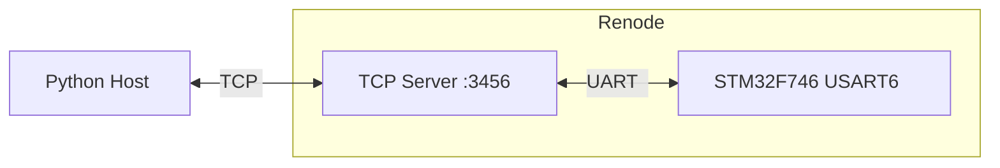

---
title:			"In Defense of RPC On MCUs"
series:			"Modern Embedded Development for MedTech"
description:	"Building an instrument protocol with CBOR-RPC"
tags:			["medtech", "embedded", "stm32", "cbor", "rpc", "renode"]
publishedDate:	2025-11-11
modifiedDate:	2025-11-11
---

import Image from '../../components/Image.astro';

import renodeDemo from '../../assets/images/in-defense-of-rpc-on-mcus/stm32f746-resc.png';
import keelIncLogo from '../../assets/images/in-defense-of-rpc-on-mcus/keel-inc-logo.png';
import keelIncDisplay from '../../assets/images/in-defense-of-rpc-on-mcus/keel-inc-display.png';

I began my career at a start-up a month or so after it got FDA clearance for its first product. Alas, the Great Financial Crisis struck mid-way through the hoped-for hockey-stick shaped ramp in revenue and the company had to sell itself on less-than-favourable terms. The buyer was a company called Inverness Medical (since renamed). After the acquisition, we (meaning, the start-up I had joined) slotted somewhat awkwardly into Inverness' portfolio of point-of-care, in-vitro diagnostic devices. "Awkwardly" because Inverness' other products were bench-top devices meant to be wheeled to the patient on a cart (or perhaps permanently situated somewhere closer than the hospital's main diagnostic laboratory) and plugged into a wall socket. Our product, meanwhile, was hand-held, battery-powered, and therefore very sensitive to power consumption. Every other product in Inverness' line-up had Cortex-A chips (i.e., the kind you'd find in a smartphone) running QNX or some flavour of Linux, while our product had Cortex-M chips (of the kind you'd find in a fancy toaster or smartphone daughterboard) and no OS at all.

So when Inverness' "platform" team announced that henceforth, all products would use `Thrift`, Facebook's RPC protocol, we all boggled. Remote procedures calls? Over Ethernet and TCP? We were using USB and Bluetooth. Fortunately for us, the leader of Inverness' platform was so ambitious that he left before his initiative bore fruit, and it died without any of us having to do anything about it. But as it turns out, using RPC in an embedded context needn't be so bad.

CBOR ([Concise Binary Object Representation](https://datatracker.ietf.org/doc/html/rfc8949)) is a data format designed for small code footprint, (potentially) small message size, and no need for version negotiation. CBOR-RPC is an informal adaptation[^1] of the widely-used JSON-RPC protocol, with the requests encoded in CBOR rather than JSON. In my [example project](https://github.com/Keel-Inc/CBOR-RPC-DeviceControl), I'll show how to use CBOR-RPC to have a host application (a Python CLI app) control an embedded device's LCD screen (a Renode simulation of an STM32F7 Discovery board).

## CBOR-RPC

All RPC protocols must specify which procedure to call and what arguments to pass it. _RPC requests_ contain this information, while _RPC responses_ indicate whether the request succeeded or failed. My CBOR-RPC protocol is based on a simplified version of JSON-RPC, suitable for point-to-point communication. The protocol supports four methods:

* `test` verifies communication by echoing a test message back to the host.
* `clear_display` clears the LCD screen to black.
* `display_default` displays the default image embedded in the device firmware.
* `display_image` displays a custom RGB565 image sent from the host.

Here's a summary:

| Method | Parameters | Response |
|--------|------------|----------|
| `test` | `message: string` | `{status, message, received_message}` |
| `clear_display` | none | `{status, message}` |
| `display_default` | none | `{status, message}` |
| `display_image` | `image_data: bytes[261120]` | `{status, message}` |

### Python Implementation

Python has several CBOR libraries with different capabilities. The most widely used[^2]—[cbor2](https://pypi.org/project/cbor2/)—provides a high-level API similar to the standard library's `json` module. The [Python host](https://github.com/Keel-Inc/CBOR-RPC-DeviceControl/blob/main/Host/cbor_host/cli.py) assembles a request as a dictionary, then calls `cbor2.dumps()` to serialize it to a byte stream which can then be sent over any serial, byte-oriented transport. (Note that here and everywhere, error handling and logging are omitted for brevity).

```python
def send_rpc_message(rpc_message: dict, host: str, port: int) -> dict:
    """Send an RPC message to the device and return the response."""
    # Connect to Renode's virtual serial port via TCP
    ser = serial.serial_for_url(f"socket://{host}:{port}", timeout=None)

    # Encode the message as CBOR
    cbor_data = cbor2.dumps(rpc_message)

    # Send length prefix (4 bytes, big-endian) followed by CBOR data
    length_prefix = struct.pack(">I", len(cbor_data))
    ser.write(length_prefix + cbor_data)

    # Read 4-byte length prefix
    length_bytes = ser.read(4)

    # Unpack length (big-endian unsigned int)
    response_length = struct.unpack(">I", length_bytes)[0]

    # Read the CBOR data
    response_bytes = ser.read(response_length)

    # Decode CBOR to get the response
    response = cbor2.loads(response_bytes)

    return response
```

Note that, aside from `host` and `port`, which are implementation details of the serial connection, the function maps a `dict` (request) to a `dict` (response). The rest of the application is a CLI-wrapper around this function. Here, for example, is the display command:

```python
@cli.command()
@click.argument("image_path")
@click.option("--host")
@click.option("--port")
def display(image_path: Optional[Path], host: str, port: int):
    """Display an image on the LCD screen"""

    if image_path is None:
        # Display default image
        rpc_message = {"method": "display_default", "params": {}}
        send_rpc_message(rpc_message, host, port)
    else:
        # Resize image to 480x272
        resized_image = resize_image(image_path, 480, 272)

        # Convert to RGB565
        rgb565_data = convert_to_rgb565(resized_image)

        # Create CBOR-RPC message with image data
        rpc_message = {"method": "display_image", "params": {"image_data": rgb565_data}}
        send_rpc_message(rpc_message, host, port)

```

### C Implementation

The [C device firmware](https://github.com/Keel-Inc/CBOR-RPC-DeviceControl/tree/main/Device/Core/Src) uses Intel's [TinyCBOR library](https://github.com/intel/tinycbor), added as a git submodule so that it can be compiled locally. TinyCBOR provides an API that treats CBOR data as a navigable structure. Here are the core functions:

* `cbor_parser_init()` initializes a parser pointing at CBOR data.
* `cbor_value_enter_container()` enters a map or array. I.e., the CBOR data is represented as nested structures: maps containing key-value pairs and arrays containing sequences. This function moves from an outer structure into an inner one.
* `cbor_value_at_end()` checks if all elements in a container have been processed. It is used to iterate over maps and arrays.
* `cbor_value_copy_text_string()` copies a text string to the provided buffer.
* `cbor_value_advance()` moves to the next element. In a map, this advances from key to value or from value to next key. In an array, it moves to the next array element.
* `cbor_value_get_string_length()` returns the length of a text string without copying it.
* `cbor_value_copy_byte_string()` copies a byte string to the provided buffer. This is a streaming function that enables direct-to-framebuffer writes.

Streaming CBOR messages—processing them incrementally without loading them fully into memory—is a crucial feature for embedded systems. Consider parsing a `display_image` request containing 261KB of image data. A non-streaming parser would need to:

1. Dynamically allocate a 261KB buffer for the image data.
2. Parse the CBOR message and populate that buffer.
3. Copy the image data from the dynamically-allocated buffer to the frame buffer.
4. Free the 261KB buffer.

TinyCBOR eliminates the dynamically-allocated buffer (so no `malloc` required) along with a copy operation. Instead, the parser walks the CBOR structure element-by-element, copying data directly to its final destination:

```c
static CborError process_cbor_rpc_message(const uint8_t *cbor_data, size_t data_length)
{
    // Initialize parser
    CborParser parser;
    CborValue value;
    cbor_parser_init(cbor_data, data_length, 0, &parser, &value);

    // Enter the request map
    CborValue map_value;
    cbor_value_enter_container(&value, &map_value);

    // Iterate through map to find "params"
    while (!cbor_value_at_end(&map_value)) {
        char key_name[32];
        size_t key_length = sizeof(key_name);
        cbor_value_copy_text_string(&map_value, key_name, &key_length, NULL);

        if (strcmp(key_name, "params") == 0) {
            // Move to params value
            cbor_value_advance(&map_value);

            // Enter params map
            CborValue params_map;
            cbor_value_enter_container(&map_value, &params_map);

            // Look for image_data parameter (ignoring other parameters for brevity)
            while (!cbor_value_at_end(&params_map)) {
                size_t param_length = sizeof(key_name);
                cbor_value_copy_text_string(&params_map, key_name, &param_length, NULL);

                if (strcmp(key_name, "image_data") == 0) {
                    // Move to image data value
                    cbor_value_advance(&params_map);

                    size_t image_data_length;
                    cbor_value_get_string_length(&params_map, &image_data_length);

                    // Copy image data directly to framebuffer
                    uint8_t *image_buffer = get_image_buffer();
                    cbor_value_copy_byte_string(&params_map, image_buffer, &image_data_length, NULL);

                    update_display();
                    break;
                }

                // Skip this key-value pair
                cbor_value_advance(&params_map);
                cbor_value_advance(&params_map);
            }
        }
    }
}
```

The code excerpt below demonstrates method routing using the `method_name` field:

```c
// Route to appropriate method handler
if (strcmp(method_name, "display_image") == 0) {
    return handle_display_image_method(&map_value);
}
else if (strcmp(method_name, "clear_display") == 0) {
    return handle_clear_display_method(&map_value);
}
else if (strcmp(method_name, "display_default") == 0) {
    return handle_display_default_method(&map_value);
}
else if (strcmp(method_name, "test") == 0) {
    return handle_test_method(&map_value);
}
else {
    send_cbor_response("error", "Unknown method");
    return CborErrorUnknownType;
}
```

Each method handler extracts its specific parameters, performs the requested operation, and sends a response, for which TinyCBOR provides parallel functions:

- `cbor_encoder_init()` initializes an encoder that will write CBOR data to the provided buffer.
- `cbor_encoder_create_map()` creates a map with a specified number of key-value pairs.
- `cbor_encode_text_string()` encodes a text string into the CBOR output.
- `cbor_encoder_close_container()` finalizes a map or array.
- `cbor_encoder_get_buffer_size()` returns how many bytes were written to the output buffer.

The firmware's response encoding mirrors the request parsing: construct a CBOR map, encode the fields, and send with a length prefix.

```c
static void send_cbor_response(const char *status, const char *message)
{
    // Create response object
    CborEncoder encoder;
    uint8_t response_buffer[256];
    cbor_encoder_init(&encoder, response_buffer, sizeof(response_buffer), 0);

    CborEncoder map_encoder;
    cbor_encoder_create_map(&encoder, &map_encoder, 2);

    // Add status
    cbor_encode_text_string(&map_encoder, "status", 6);
    cbor_encode_text_string(&map_encoder, status, strlen(status));

    // Add message
    cbor_encode_text_string(&map_encoder, "message", 7);
    cbor_encode_text_string(&map_encoder, message, strlen(message));

    cbor_encoder_close_container(&encoder, &map_encoder);

    size_t encoded_size = cbor_encoder_get_buffer_size(&encoder, response_buffer);

    // Send length prefix (4 bytes, big-endian)
    uint8_t length_prefix[4];
    length_prefix[0] = (uint8_t)(encoded_size >> 24);
    length_prefix[1] = (uint8_t)(encoded_size >> 16);
    length_prefix[2] = (uint8_t)(encoded_size >> 8);
    length_prefix[3] = (uint8_t)(encoded_size & 0xFF);

    HAL_UART_Transmit(&huart6, length_prefix, 4, HAL_MAX_DELAY);
    HAL_UART_Transmit(&huart6, response_buffer, encoded_size, HAL_MAX_DELAY);
}
```

## Renode

I have an ST Discovery Kit, and it has an LCD screen, so I could have implemented the demo on hardware, but I'm always on the lookout for good simulation and emulation options (to facilitate automated testing) so I decided to try out [Renode](https://renode.io/about/). First, I wanted to see which STM32 systems it simulated out-of-box:

```powershell
winget install --id Renode.Renode -e
& 'C:\Program Files\Renode\bin\Renode.exe' --version
ls 'C:\Program Files\Renode\scripts\single-node\*stm32*.resc'
```

The first two commands install Renode and verify that it is working. The last was intended to see which systems and peripherals were supported, but it's a bit more complicated than that. The command yielded `stm32f746.resc` (among others), but when I looked inside that file, it seemed like only `usart1` and `ltdc` were supported:

```renode
:name: STM32F746
:description: This script runs Dartino on STM32F7 Discovery.

using sysbus
$name?="STM32F746"
mach create $name

machine LoadPlatformDescription @platforms/boards/stm32f7_discovery-bb.repl

ltdc FramesPerVirtualSecond 100

showAnalyzer usart1
showAnalyzer ltdc

$bin ?= @https://dl.antmicro.com/projects/renode/dartino-lines.elf-s_486816-cd8876ab9de60af779f4429dfe16c79bf831b84d

macro reset
"""
    sysbus LoadELF $bin
"""

runMacro $reset
```

Later I learned that `@platforms/boards/stm32f7_discovery-bb.repl` (and the `using "platforms/cpus/stm32f746.repl"` statement within it) was doing all the work of defining peripherals, and that `stm32f746.resc` was, in fact, defining all the peripherals I needed and more.

Next, I wanted to get the basic demo working. After some trial and error, I settled on the command below, which launches Renode with the monitor in the shell that executed the command rather than a separate window (thanks to the `--console` flag).

```powershell
renode --console -e 'start @scripts/single-node/stm32f746.resc'
```

The rest of the command, `-e 'start @scripts/single-node/stm32f746.resc'`, instructs Renode to execute the `stm32f746.resc` file that I found earlier. This opens two windows: a UART1 analyzer showing serial output and an LTDC (LCD-TFT Display Controller) window displaying the LCD screen (pictured below).

<Image src={renodeDemo} alt="STM32F746 Renode demo showing a recreation of the Mistify screen saver from Windows 95" />

### Device ELF

Confident I could get _an_ ELF (Executable and Linkable Format) to run, I turned to getting _my_ ELF to run, eventually working out this Renode script:

```renode
# Set the binary
$bin = @Device/build/RelWithDebInfo/Device.elf

# Include the built-in stm32f746 script
i @scripts/single-node/stm32f746.resc

# Configure USART6 to be accessible via TCP on port 3456
emulation CreateServerSocketTerminal 3456 "usart6-terminal" false
connector Connect usart6 usart6-terminal

# Start the simulation
start
```

Setting `$bin` before including `stm32f746.resc`, as happens on the following line, overrides the latter's default value for the former[^3]. The `@` prefix tells Renode to search for the included path first in its installation directory, then in the current working directory if not found. Built-in resources like platform files use the installation directory, while project files use the CWD fallback (as in the second line).

The `CreateServerSocketTerminal` command creates a TCP server on port 3456 that forwards data to and from USART6. The third parameter (`false`) tells Renode not to create an analyzer window for this serial port—the host application connects via TCP instead. Here's what that looks like:



The host application connects to `localhost:3456` using `pySerial`'s socket URL syntax (from `send_rpc_message()`):

```python
ser = serial.serial_for_url(f"socket://{host}:{port}", timeout=None)
```

## Generating and Displaying Images

When I was planning out this article, I needed some data to send from the host to the device. My first idea was to send LED commands (e.g., `ON`, `OFF`, `BLINK`, etc); but I thought that would be visually boring and trivial to implement. Instead, I decided to display an image on the simulated LCD screen, which I would send over CBOR-RPC. But this entailed a side-quest in generating and displaying images. For generation, I used an AI model to generate a would-be logo for Keel Inc, but it produced a square PNG:

<Image src={keelIncLogo} alt="Square Keel Inc logo with a navy blue ship's keel on a cream background" class="w-1/3" />

While I needed a rectangular RGB565. And since I wanted to make sure I could display the image before I tried sending it[^4], I needed a version that could be hard-coded into a C source file.

I initially experimented with a combination of `ffmpeg`, PowerShell, and Python, but eventually I came to my senses and bundled all the functionality I need into the Python host, which lets me share the resize and conversion logic for generating an image with the function for sending it directly to the device.

```powershell
host make-header -i .\Images\Keel-Inc.png `
    -o Device\Core\Inc\default_image_rgb565.h
```

This command resizes the input image to 480x272 (the size of the STM32F746 Discovery board's LCD screen), center-cropping to maintain aspect ratio, converts it to RGB565. Then it writes a C header-like file containing the pixel data as a uint16_t array. The file is "header-like" because it doesn't declare a variable, it's just a comment and a list of 16-bit hex values, like this:

```c
// Generated automatically - do not edit
0xFF9B, 0xFFBB, 0xFFBB, 0xFF9B, 0xFFBB, 0xFF9B, 0xFFBB, 0xFFBB,
0xFFBB, 0xFF9B, 0xFFBB, 0xFFBB, 0xFF9B, 0xFFBB, 0xFF9B, 0xFFBB,
0xFFBB, 0xFFBB, 0xFFBB, 0xFFBB, 0xFFBB, 0xFF9B, 0xFFBB, 0xFFBB,
// And so on for 9k more rows...
```

This lets me declare the default image like so:

```c
const uint16_t default_image_data[] = {
#include "default_image_rgb565.h"
};
```

This is maybe a bit too weird to pass muster in a production codebase, but here are the advantages:

1. The code generator doesn't need to know the variable name.
2. The image data can be declared directly in the source file where it is used without requiring `extern`.

The STM32F746 that we're simulating with Renode has 340KB of SRAM, but the frame buffer requires 261,120 bytes (480 × 272 × 2). Since we also need a slightly larger buffer to hold the incoming message, we don't have enough SRAM to go around. Therefore, the firmware stores the frame buffer (and the communication buffers) in external SDRAM using custom linker sections:


```c
// comm.c
static uint8_t cbor_buffer[CBOR_BUFFER_SIZE] __attribute__((section(".sdram")));
static uint8_t usart6_rx_buffer[USART6_RX_BUFFER_SIZE] __attribute__((section(".sdram")));

// image.c
uint16_t framebuffer[IMAGE_PIXEL_COUNT] __attribute__((section(".sdram")));
```

Once the image data is ready (whether hard-coded, or having been received from the host), the LTDC peripheral reads directly from the frame buffer and drives the LCD panel. Updating the display requires only a single call:

```c
HAL_LTDC_SetAddress(&hltdc, (uint32_t)framebuffer, 0);
```

This tells the LTDC where to find the pixel data. The controller then transfers pixels to the display continuously without CPU intervention. Whether the frame buffer contains the default image, a cleared screen, or newly-received CBOR data, the display mechanism remains the same. Here is the culmination of my efforts, the displayed logo:

<Image src={keelIncDisplay} alt="Renode simulation showing the Keel Inc logo displayed on the STM32F746 LCD screen" />

## Next

Was anything unclear or confusing in this article? Is it adjacent-to, but not quite what you need? Email [in-defense-of-rpc-on-mcus@keel-inc.com](mailto:in-defense-of-rpc-on-mcus@keel-inc.com) and let me help.

[^1]: Although _CBOR_ is an Internet Engineering Task Force standard, the combination of CBOR and RPC is not, nor is it a standard of any other similar organization.

[^2]: As of this writing, `cbor2` is downloaded [hundreds of thousands](https://pypistats.org/packages/cbor2) of times per day compared to `cbor`'s [tens of thousands](https://pypistats.org/packages/cbor).

[^3]: I.e., `$bin` in `stm32f746.resc` is set via the `?=` operator, which indicates a default value that only takes effect if the variable isn't already set.

[^4]: I wanted this so that I could implement and verify the image transfer and image display separately. If I had tried doing them together, when it didn't work (and they _didn't_ work, at first), I wouldn't know which part to debug. Instead, I made sure that displaying a hard-coded image worked, then I made sure I could send an image. Once I knew both pieces worked independently, I put them together (which _also_ didn't work the first time).